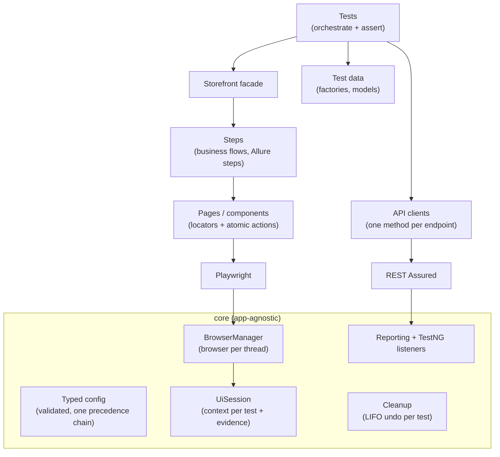

# Playwright Java Test Automation Framework

UI + API test automation framework for the public storefront [automationexercise.com](https://automationexercise.com),
built the way a production framework should be: layered, parallel-safe, configurable from one place,
and debuggable from the report alone.

| Area | Choice |
|---|---|
| Language / build | Java 21, Maven |
| Runner | TestNG (parallel methods, suites, groups) |
| UI | Playwright for Java (Chromium, Chrome, Edge, Firefox, WebKit) |
| API | REST Assured + Jackson, JSON Schema contract checks |
| Assertions | Playwright web-first assertions (UI), AssertJ (data) |
| Reporting | Allure: steps, request/response, screenshots, traces, videos |
| Test data | Datafaker, unique per test |
| CI | GitHub Actions: PR smoke, main regression, weekly cross-browser, report on GitHub Pages |

## Architecture



```
src/main/java/qa
├── core                       # reusable for any web app
│   ├── config                 # FrameworkConfig, ConfigLoader, enums
│   ├── browser                # BrowserManager, ContextFactory, UiSession
│   ├── api                    # BaseApiClient, ApiResult, logging filter
│   ├── data                   # Cleanup registry
│   ├── json                   # shared Jackson mapper
│   ├── reporting              # Allure attachments
│   └── testng                 # suite listener, opt-in retry
└── app                        # automationexercise.com specifics
    ├── api/clients, api/models
    ├── data                   # UserAccount, UserFactory, Money
    └── ui
        ├── pages, components
        ├── steps              # AuthSteps, CatalogSteps, CartSteps
        └── Storefront.java    # entry point used by tests
src/test/java/qa/tests
├── base                       # BaseTest, BaseUiTest, Groups
├── api                        # ProductsApiTest, UserAccountApiTest
└── ui                         # AuthUiTest, CatalogUiTest, CartUiTest
src/test/resources
├── suites                     # smoke, regression, api, ui, ui-smoke
└── schemas                    # JSON Schemas for contract checks
```

## Key design decisions

**Browser per thread, context per test.** Launching a browser is slow; creating a context is cheap and gives
complete isolation (cookies, storage, cart). Each worker thread owns one `Playwright` + `Browser`
(Playwright Java is not thread-safe), every test gets a fresh `BrowserContext`.

**ThreadLocal sessions.** With `parallel="methods"` TestNG shares one test-class instance across threads,
so the UI session is never an instance field.

**API-assisted setup.** UI tests create their users through the API and delete them afterwards; the browser
is only used for the behaviour under test. This makes UI tests faster and failures more meaningful.

**Guaranteed, ordered cleanup.** Data created by a test registers its undo action in `Cleanup`;
actions run in reverse order after every test, pass or fail, and a failing cleanup never hides the others.

**Cross-layer checks.** Some tests verify the UI against the API (search results, product details,
registration really created an account), catching inconsistencies a single layer cannot see.

**One configuration chain.** Every key resolves the same way:
`-Dkey` → `KEY` environment variable → `env-<env>.properties` → `default.properties`.
All values are validated at startup and every problem is reported at once.

**Evidence by default, cost only on failure.** Traces are recorded for every test but kept only when it fails;
failures also get a full-page screenshot and URL. Everything is attached to Allure.

**Emulation is not device coverage.** Device profiles (`iphone_14`, `pixel_7`, …) emulate viewport, touch
and user agent for responsive checks. Native mobile testing lives in a separate Appium framework.

**Third-party blocking.** Ad, analytics and consent scripts are aborted at network level, removing the most
common source of flakiness on public demo sites.

## Getting started

Prerequisites: JDK 21+, Maven 3.9+.

```bash
# Optional, once: add the Maven wrapper so others need no local Maven
mvn -N wrapper:wrapper

# Browsers are downloaded automatically on the first run; or install explicitly:
mvn exec:java -e -Dexec.mainClass=com.microsoft.playwright.CLI -Dexec.args="install chromium"

mvn verify -Dsuite=smoke          # critical paths, API + UI
mvn verify -Dsuite=regression     # everything (default)
mvn verify -Dsuite=api            # API only, no browser needed
mvn allure:serve                  # open the report
```

### Useful overrides

```bash
mvn verify -Dsuite=ui -Dbrowser=firefox
mvn verify -Dsuite=ui -Dheadless=false -Dslowmo.ms=300     # watch it run
mvn verify -Dsuite=ui -Ddevice=iphone_14                   # responsive layout
mvn verify -Dtrace=on -Dvideo=retain_on_failure            # more evidence
mvn verify -Dthreads=8                                     # override suite thread count
```

| Key | Default | Values |
|---|---|---|
| `env` | `prod` | any `env-<name>.properties` |
| `browser` | `chromium` | chromium, chrome, msedge, firefox, webkit |
| `headless` | `true` | true / false |
| `device` | `desktop` | desktop, laptop, tablet, iphone_14, pixel_7 |
| `trace` / `video` | `retain_on_failure` / `off` | off, on, retain_on_failure |
| `threads` | `0` (use suite XML) | 0–32 |
| `retry.max` | `0` | 0–3, applies only to tests that opt in |

Full list with comments: [`default.properties`](src/main/resources/config/default.properties).

### Debugging a failure
1. Open the Allure report: the failed test has the screenshot, URL, all steps and HTTP calls.
2. Download the attached `trace.zip` and run `npx playwright show-trace trace.zip`:
   a timeline with DOM snapshots, network and console for every action.

## CI

| Trigger | API | UI |
|---|---|---|
| Pull request | all API tests | UI smoke, Chromium |
| Push to `main` | all API tests | full UI, Chromium |
| Weekly schedule | all API tests | full UI on Chromium, Firefox, WebKit |
| Manual | choose suite and browser | |

The Allure report from `main` and scheduled runs is published to GitHub Pages
(enable Pages with source "GitHub Actions" in the repository settings).

## Roadmap
- AI-assisted workflow: Claude Code skills to generate scenarios, automate cases, debug failures (see `CLAUDE.md`)
- Test-management integration: case ids on tests, results pushed after each run
- Visual regression checks for key pages
- Companion repository: Appium framework for native Android and iOS
