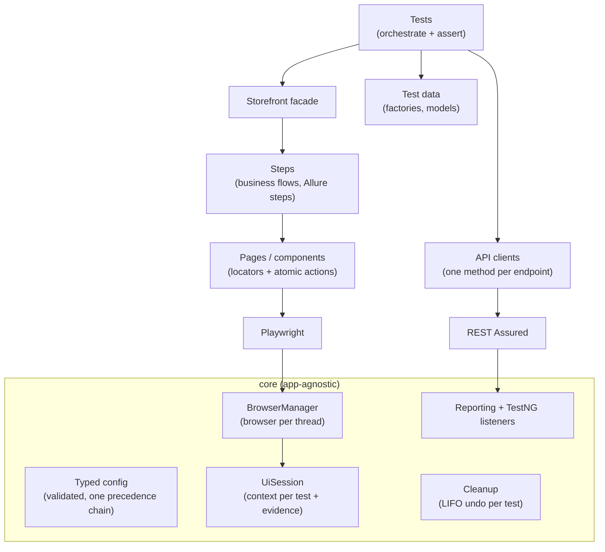

# Playwright Java Test Automation Framework

UI + API test automation framework for the public storefront [automationexercise.com](https://automationexercise.com),
built the way a production framework should be: layered, parallel-safe, configurable from one place,
and debuggable from the report alone. Test cases live in Git and in [Qase](https://qase.io), and an
AI-assisted workflow built on Claude Code takes a case from story to linked, passing test.

**Live Allure report:** https://annamandzulashvili-eng.github.io/playwright-java-framework/

| Area | Choice |
|---|---|
| Language / build | Java 21, Maven |
| Runner | TestNG (parallel methods, suites, groups) |
| UI | Playwright for Java (Chromium, Chrome, Edge, Firefox, WebKit) |
| API | REST Assured + Jackson, JSON Schema contract checks |
| Assertions | Playwright web-first assertions (UI), AssertJ (data) |
| Reporting | Allure: steps, request/response, screenshots, traces, videos |
| Test data | Datafaker, unique per test |
| Test management | Qase: cases mirrored from `scenarios/`, `@QaseId` links, one Qase run per CI run |
| AI workflow | Claude Code skills, read-only subagents, Qase + Playwright MCP servers |
| CI | GitHub Actions: PR smoke, main regression, weekly cross-browser, report on GitHub Pages |

## Architecture



```
src/main/java/qa
├── core                       # reusable for any web app
│   ├── config                 # FrameworkConfig, ConfigLoader, enums
│   ├── browser                # BrowserManager, ContextFactory, UiSession
│   ├── api                    # BaseApiClient, ApiResult, logging filter
│   ├── data                   # Cleanup registry
│   ├── json                   # shared Jackson mapper
│   ├── reporting              # Allure attachments
│   └── testng                 # suite listener, opt-in retry
└── app                        # automationexercise.com specifics
    ├── api/clients, api/models
    ├── base                   # BaseTest, BaseUiTest, Groups (test lifecycle every test extends)
    ├── data                   # UserAccount, UserFactory, Money
    └── ui
        ├── pages, components
        ├── steps              # AuthSteps, CatalogSteps, CartSteps
        └── Storefront.java    # entry point used by tests
src/test/java/qa/tests          # test classes only
├── api                        # ProductsApiTest, UserAccountApiTest
└── ui                         # AuthUiTest, CatalogUiTest, CartUiTest
src/test/resources
├── suites                     # smoke, regression, api, ui, ui-smoke
└── schemas                    # JSON Schemas for contract checks
```

## Key design decisions

**Browser per thread, context per test.** Launching a browser is slow; creating a context is cheap and gives
complete isolation (cookies, storage, cart). Each worker thread owns one `Playwright` + `Browser`
(Playwright Java is not thread-safe), every test gets a fresh `BrowserContext`.

**ThreadLocal sessions.** With `parallel="methods"` TestNG shares one test-class instance across threads,
so the UI session is never an instance field.

**API-assisted setup.** UI tests create their users through the API and delete them afterwards; the browser
is only used for the behaviour under test. This makes UI tests faster and failures more meaningful.

**Guaranteed, ordered cleanup.** Data created by a test registers its undo action in `Cleanup`;
actions run in reverse order after every test, pass or fail, and a failing cleanup never hides the others.

**Cross-layer checks.** Some tests verify the UI against the API (search results, product details,
registration really created an account), catching inconsistencies a single layer cannot see.

**One configuration chain.** Every key resolves the same way:
`-Dkey` → `KEY` environment variable → `env-<env>.properties` → `default.properties`.
All values are validated at startup and every problem is reported at once.

**Evidence by default, cost only on failure.** Traces are recorded for every test but kept only when it fails;
failures also get a full-page screenshot and URL. Everything is attached to Allure.

**Emulation is not device coverage.** Device profiles (`iphone_14`, `pixel_7`, …) emulate viewport, touch
and user agent for responsive checks. Native mobile testing lives in a separate Appium framework.

**Overload-aware, not retry-happy.** When the public demo site answers 502/503/504 or its "heavy load" page,
the request or navigation is re-sent with a short backoff (`overload.retries`, default 2). Assertion failures are never
retried, and a site that stays down fails with `ServiceOverloadedException`, grouped in Allure as an infrastructure issue.

**Third-party blocking.** Ad, analytics and consent scripts are aborted at network level, removing the most
common source of flakiness on public demo sites.

## Getting started

Prerequisites: JDK 21+, Maven 3.9+.

```bash
# Optional, once: add the Maven wrapper so others need no local Maven
mvn -N wrapper:wrapper

# Browsers are downloaded automatically on the first run; or install explicitly:
mvn exec:java -e -Dexec.mainClass=com.microsoft.playwright.CLI -Dexec.args="install chromium"

mvn verify -Dsuite=smoke          # critical paths, API + UI
mvn verify -Dsuite=regression     # everything (default)
mvn verify -Dsuite=api            # API only, no browser needed
mvn allure:serve                  # open the report
```

### Useful overrides

```bash
mvn verify -Dsuite=ui -Dbrowser=firefox
mvn verify -Dsuite=ui -Dheadless=false -Dslowmo.ms=300     # watch it run
mvn verify -Dsuite=ui -Ddevice=iphone_14                   # responsive layout
mvn verify -Dtrace=on -Dvideo=retain_on_failure            # more evidence
mvn verify -Dthreads=8                                     # override suite thread count
```

| Key | Default | Values |
|---|---|---|
| `env` | `prod` | any `env-<name>.properties` |
| `browser` | `chromium` | chromium, chrome, msedge, firefox, webkit |
| `headless` | `true` | true / false |
| `device` | `desktop` | desktop, laptop, tablet, iphone_14, pixel_7 |
| `trace` / `video` | `retain_on_failure` / `off` | off, on, retain_on_failure |
| `threads` | `0` (use suite XML) | 0–32 |
| `retry.max` | `0` | 0–3, applies only to tests that opt in |

Full list with comments: [`default.properties`](src/main/resources/config/default.properties).

### Debugging a failure
1. Open the Allure report: the failed test has the screenshot, URL, all steps and HTTP calls.
2. Download the attached `trace.zip` and run `npx playwright show-trace trace.zip`:
   a timeline with DOM snapshots, network and console for every action.

## CI

| Trigger | API | UI |
|---|---|---|
| Pull request | all API tests | UI smoke, Chromium |
| Push to `main` | all API tests | full UI, Chromium |
| Weekly schedule | all API tests | full UI on Chromium, Firefox, WebKit |
| Manual | choose suite and browser | |

The Allure report from `main` and scheduled runs is published to GitHub Pages
(enable Pages with source "GitHub Actions" in the repository settings).

## Test management (Qase)

Every test case exists three times, kept consistent automatically:

| Where | What | Kept in sync by |
|---|---|---|
| Qase project `PJF` | **source of truth**: review and approval (Draft → Actual), history, run dashboards | the user + `tm-*` skills ([mapping and lifecycle](docs/ai/qase-mapping.md)) |
| `scenarios/cases/<key>.json` | Git snapshot of the approved case, reviewed in pull requests | written by `automate-*`, refreshed by `sync-scenario` ([schema](scenarios/schema.json)) |
| one `@Test` method with `@QaseId` | executable check | `scripts/validate_ai_config.py` in CI |

Results are reported by the official [Qase TestNG reporter](https://github.com/qase-tms/qase-java). CI opens one Qase run,
API and UI jobs report into it in parallel, and a final job completes it. Reporting is off locally and on pull requests,
and switches on in CI with the repository variable `QASE_REPORTING=true` (plus secret `QASE_API_TOKEN` and variable `QASE_PROJECT`).

## AI-assisted workflow (Claude Code)

```mermaid
flowchart LR
    S["Story"] -->|/generate-scenario| DR[("Qase case<br/>Draft · ai_generated")]
    DR -->|human review in Qase| AC[("Qase case<br/>Actual")]
    AC -->|/automate-ui-scenario<br/>/automate-api-scenario<br/>+ /stable-locators| T["Test + @QaseId"]
    T --> V{"compile + run x2<br/>+ test-reviewer"}
    V -->|green| L["tag ai_automated"]
    V -->|red| D["/debug-failing-test<br/>+ failure-analyst"]
    D --> T
    AC -. case edited .->|/sync-scenario| T
```

AI writes, a human approves: `generate-scenario` can only create **Draft** cases, and the automation skills refuse
anything that is not **Actual**. The review in Qase is the gate between the two.

| Piece | Purpose |
|---|---|
| [`CLAUDE.md`](CLAUDE.md) | architecture and coding rules every AI change must follow |
| [`.claude/skills/`](.claude/skills) | 9 skills: workflows `generate-scenario`, `automate-ui-scenario`, `automate-api-scenario`, `debug-failing-test`, `sync-scenario`; `stable-locators` for UI locators; test-management blocks `tm-get-case`, `tm-set-tags` and the one-time `tm-upload-scenarios` |
| [`.claude/agents/`](.claude/agents) | read-only subagents: `failure-analyst` (root cause from evidence), `test-reviewer` (rules + scenario fidelity) |
| [`.mcp.json`](.mcp.json) | Qase MCP (cases, tags, defects) and Playwright MCP (inspect the live UI before writing locators) |
| [`.claude/settings.json`](.claude/settings.json) | permissions: reads auto-approved, every Qase write asks, deletes and `git push` denied |

Guardrails, because AI output is only useful when it can be trusted:
- only human-approved (Actual) cases are automated;
- locators come from the live page through `stable-locators` (unique, stable, scoped), never from guesses; API facts are confirmed by a run;
- a test is linked and tagged only after it compiles and passes twice and the reviewer subagent has checked it;
- every write to Qase is previewed and approved, then read back and verified;
- the validator in CI fails the build if scenarios, `@QaseId`s, skills or MCP config drift apart.

### Try it

```bash
cp .env.example .env            # add your Qase token; .env is git-ignored
set -a; source .env; set +a     # PowerShell: see .env.example
claude                          # start Claude Code in the repo, approve the project MCP servers
/tm-upload-scenarios all        # once: upload the existing tests' cases to Qase and link @QaseId
/generate-scenario "As a shopper I can subscribe to the newsletter from the footer"
                                # -> Draft cases in Qase; review them and set Status = Actual
/automate-ui-scenario PJF-25    # automate an approved case
```

## Roadmap
- Visual regression checks for key pages
- Companion repository: Appium framework for native Android and iOS
